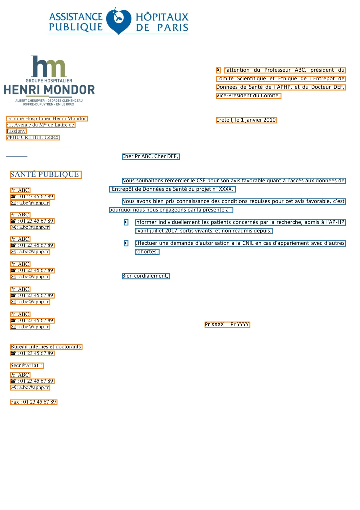

# Rule-based extraction

Let's create a rule-based extractor for PDF documents.

!!! note

    This pipeline will likely perform poorly as soon as your PDF documents
    come in varied forms. In that case, even a very simple trained pipeline
    may give you a substantial performance boost (see [next section](training.md)).

First, download this example [PDF](https://github.com/aphp/edspdf/raw/main/tests/resources/letter.pdf).

We will use the following configuration:

```toml title="config.cfg"
[pipeline]
components = ["extractor", "classifier", "aggregator"]
components_config = ${components}

[components.extractor]
@factory = "pdfminer-extractor"  # (2)
extract_style = true

[components.classifier]
@factory = "mask-classifier"  # (3)
x0 = 0.2
x1 = 0.9
y0 = 0.3
y1 = 0.6
threshold = 0.1

[components.aggregator]
@factory = "simple-aggregator"  # (4)
```

1. This is the top-level object, which organises the entire extraction process.
2. Here we use the provided text-based extractor, based on the PDFMiner library
3. This is where we define the rule-based classifier. Here, we use a "mask",
   meaning that every text bloc that falls within the boundaries will be assigned
   the `body` label, everything else will be tagged as pollution.
4. This aggregator returns a tuple of dictionaries. The first contains compiled text for each
   label, the second exports their style.

Save the configuration as `config.cfg` and run the following snippet:

```python
import edspdf
import pandas as pd
from pathlib import Path

model = edspdf.load("config.cfg")  # (1)

# Get a PDF
pdf = Path("/Users/perceval/Development/edspdf/tests/resources/letter.pdf").read_bytes()
pdf = model(pdf)

body = pdf.aggregated_texts["body"]

text, style = body.text, body.properties
print(text)
print(pd.DataFrame(style))
```

This code will output the following results:

=== "Visualisation"

    

=== "Extracted Text"

    ```
    Cher Pr ABC, Cher DEF,

    Nous souhaitons remercier le CSE pour son avis favorable quant à l’accès aux données de
    l’Entrepôt de Données de Santé du projet n° XXXX.

    Nous avons bien pris connaissance des conditions requises pour cet avis favorable, c’est
    pourquoi nous nous engageons par la présente à :

    • Informer individuellement les patients concernés par la recherche, admis à l'AP-HP
    avant juillet 2017, sortis vivants, et non réadmis depuis.

    • Effectuer une demande d'autorisation à la CNIL en cas d'appariement avec d’autres
    cohortes.

    Bien cordialement,
    ```

=== "Extracted Style"

    The `start` and `end` columns refer to the character indices within the extracted text.

    | italic | bold   | fontname       | start | end |
    |--------|--------|----------------|-------|-----|
    | False  | False  | BCDFEE+Calibri | 0     | 22  |
    | False  | False  | BCDFEE+Calibri | 24    | 90  |
    | False  | False  | BCDHEE+Calibri | 90    | 91  |
    | False  | False  | BCDFEE+Calibri | 91    | 111 |
    | False  | False  | BCDFEE+Calibri | 112   | 113 |
    | False  | False  | BCDHEE+Calibri | 113   | 114 |
    | False  | False  | BCDFEE+Calibri | 114   | 161 |
    | False  | False  | BCDFEE+Calibri | 163   | 247 |
    | False  | False  | BCDHEE+Calibri | 247   | 248 |
    | False  | False  | BCDFEE+Calibri | 248   | 251 |
    | False  | False  | BCDFEE+Calibri | 252   | 300 |
    | False  | False  | SymbolMT       | 302   | 303 |
    | False  | False  | BCDFEE+Calibri | 304   | 386 |
    | False  | False  | BCDFEE+Calibri | 387   | 445 |
    | False  | False  | SymbolMT       | 447   | 448 |
    | False  | False  | BCDFEE+Calibri | 449   | 523 |
    | False  | False  | BCDHEE+Calibri | 523   | 524 |
    | False  | False  | BCDFEE+Calibri | 524   | 530 |
    | False  | False  | BCDFEE+Calibri | 531   | 540 |
    | False  | False  | BCDFEE+Calibri | 542   | 560 |
